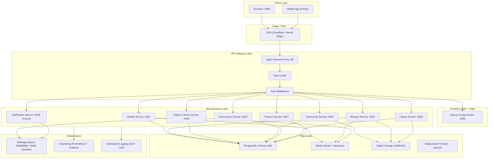
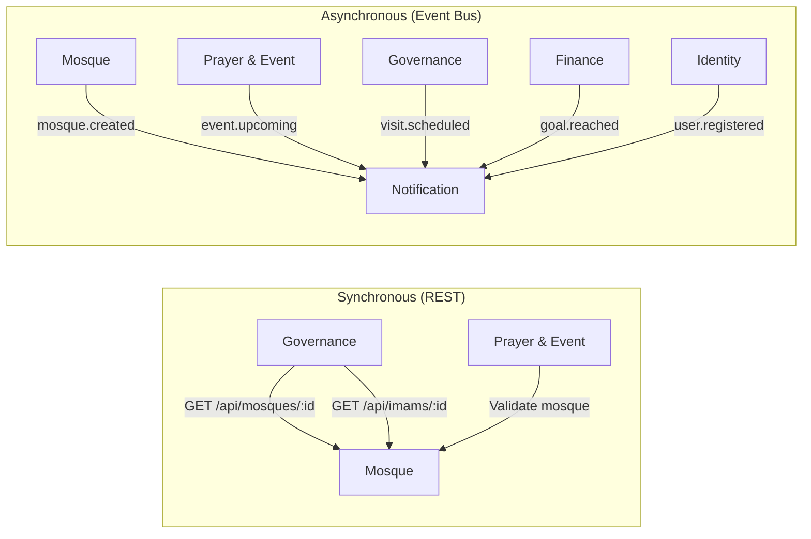
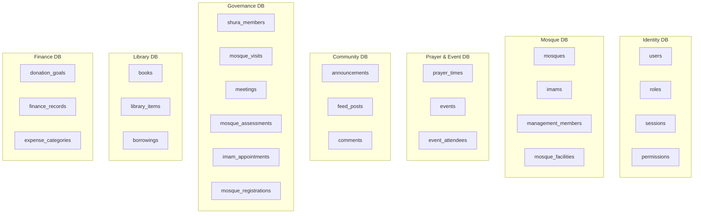
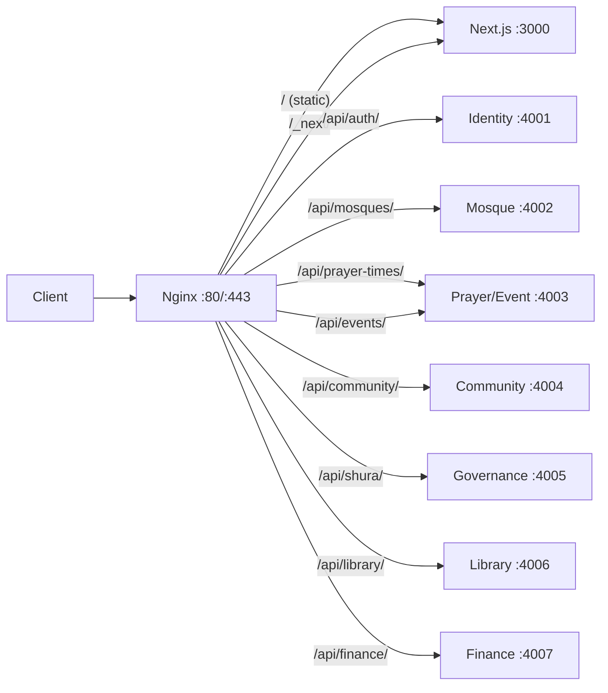
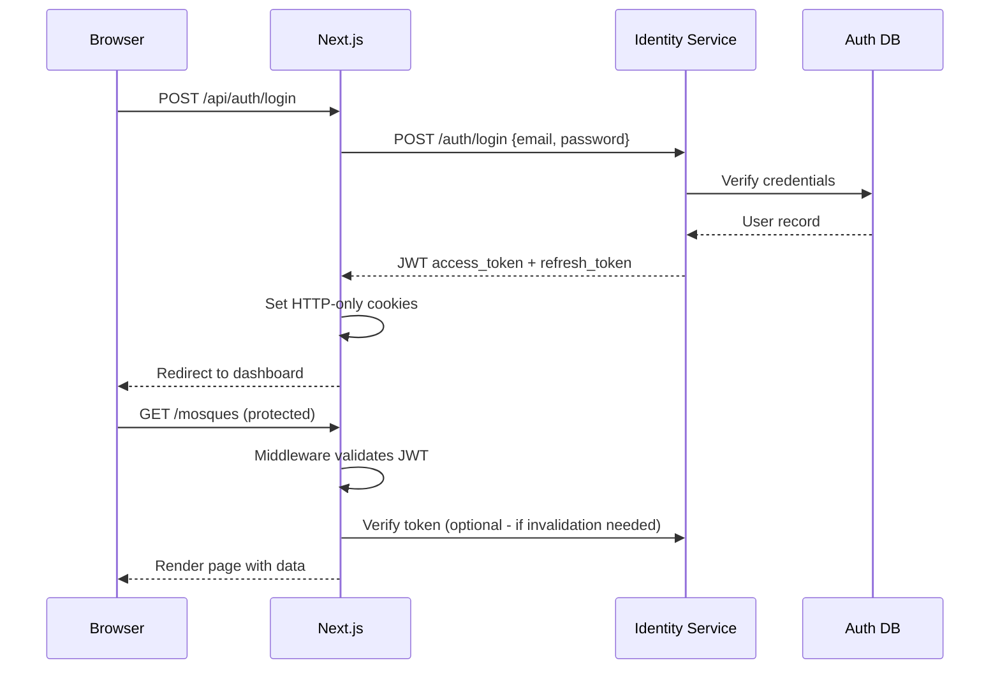

# MosqueConnect — Fullstack Architecture & System Design

> A comprehensive architectural blueprint for a scalable, reliable, and robust mosque management platform.

---

## 1. High-Level System Architecture



---

## 2. Technology Stack

| Layer | Current | Recommended (Production-Grade) |
|---|---|---|
| **Frontend** | Next.js 15, TypeScript, Tailwind v4, Zustand, Radix UI | ✅ Keep — add React Query for server-state |
| **Backend** | Express.js (plain JS, mock data) | Migrate to **TypeScript + Prisma ORM** |
| **API Gateway** | Nginx + Node.js `gateway.js` | Consolidate to **Nginx only** (Docker) or **Kong/Traefik** |
| **Database** | In-memory mock arrays | **PostgreSQL 16** (primary) + **Redis 7** (cache) |
| **Auth** | None | **NextAuth.js v5** (frontend) + **JWT/Passport.js** (services) |
| **File Storage** | Unsplash URLs | **MinIO (self-hosted S3)** or **AWS S3** |
| **Message Queue** | None | **Redis Streams** (lightweight) or **RabbitMQ** |
| **Search** | None | **PostgreSQL Full-Text** → **Elasticsearch** (at scale) |
| **Containerization** | Docker Compose (dev) | **Docker Compose** (dev) + **Kubernetes** (prod) |
| **CI/CD** | None | **GitHub Actions** → Docker registry → K8s deploy |
| **Monitoring** | None | **Prometheus + Grafana** (metrics), **Loki** (logs) |

---

## 3. Microservices Architecture

### 3.1 Service Responsibility Matrix

| Service | Port | Domain Entities | Responsibilities |
|---|---|---|---|
| **Identity** | 4001 | User, Role, Session | Auth, registration, profiles, RBAC |
| **Mosque** | 4002 | Mosque, Imam, ManagementMember | Mosque CRUD, imam profiles, committee data |
| **Prayer & Event** | 4003 | PrayerTime, Event | Prayer time CRUD, event management, recurrence |
| **Community** | 4004 | Announcement, FeedPost | Community feed, announcements, moderation |
| **Governance** | 4005 | ShuraMember, Visit, Meeting, Registration, Appointment | Shura council, mosque assessments, imam pipeline |
| **Library** | 4006 | Book, LibraryItem, Borrowing | Book catalog, inventory, borrowing workflow |
| **Finance** | 4007 | DonationGoal, FinanceRecord | Donations, expenses, campaigns, reports |
| **Notification** *(future)* | 4008 | Notification, Template | Email, SMS, push, in-app notifications |

### 3.2 Inter-Service Communication



> **Pattern**: Services communicate via **REST for queries** and **async events for side-effects**. This keeps services decoupled while maintaining data consistency.

### 3.3 Recommended Internal Service Structure

Each microservice follows a **layered architecture**:

```
services/<service-name>/
├── src/
│   ├── config/              # Environment config, DB connection
│   │   ├── database.ts
│   │   ├── redis.ts
│   │   └── index.ts
│   ├── controllers/         # HTTP request handlers (thin layer)
│   │   └── mosque.controller.ts
│   ├── services/            # Business logic
│   │   └── mosque.service.ts
│   ├── repositories/        # Data access (Prisma queries)
│   │   └── mosque.repository.ts
│   ├── middleware/           # Auth, validation, error handling
│   │   ├── auth.middleware.ts
│   │   ├── validate.middleware.ts
│   │   └── error.middleware.ts
│   ├── routes/              # Express route definitions
│   │   └── mosque.routes.ts
│   ├── validators/          # Zod schemas for request validation
│   │   └── mosque.validator.ts
│   ├── events/              # Event publishers and subscribers
│   │   ├── publishers.ts
│   │   └── subscribers.ts
│   ├── types/               # TypeScript interfaces
│   │   └── index.ts
│   ├── utils/               # Helpers, constants
│   │   └── index.ts
│   └── index.ts             # App entry point
├── prisma/
│   ├── schema.prisma        # Database schema
│   └── migrations/          # Migration files
├── tests/
│   ├── unit/
│   └── integration/
├── Dockerfile
├── package.json
├── tsconfig.json
└── .env.example
```

---

## 4. Frontend Architecture

### 4.1 Current Stack (Keep & Enhance)

- **Next.js 15** — App Router with RSC (React Server Components)
- **TypeScript** — End-to-end type safety
- **Tailwind CSS v4** — Utility-first styling
- **Radix UI** — Accessible primitives
- **Zustand** — Client-side state management
- **React Hook Form + Zod** — Form handling & validation

### 4.2 Recommended Additions

| Addition | Why |
|---|---|
| **@tanstack/react-query** | Server-state management, caching, background refetching |
| **NextAuth.js v5** | Authentication with OAuth, credentials, magic links |
| **next-intl** | i18n for Arabic, Urdu, English, etc. |
| **Sentry** | Error tracking and performance monitoring |
| **Playwright** | End-to-end browser testing |

### 4.3 Frontend Folder Structure (Recommended)

```
frontend/
├── app/                          # Next.js App Router
│   ├── (auth)/                   # Route group — authentication
│   │   ├── login/page.tsx
│   │   ├── register/page.tsx
│   │   └── layout.tsx
│   ├── (dashboard)/              # Route group — authenticated area
│   │   ├── admin/
│   │   ├── mosques/
│   │   │   ├── [id]/
│   │   │   │   ├── page.tsx                    # Mosque profile
│   │   │   │   ├── imam/[imamId]/page.tsx      # Imam profile
│   │   │   │   ├── management/[memberId]/page.tsx
│   │   │   │   ├── events/page.tsx
│   │   │   │   ├── library/page.tsx
│   │   │   │   └── finance/page.tsx
│   │   │   └── page.tsx                        # Mosque directory
│   │   ├── prayer-times/page.tsx
│   │   ├── community/
│   │   ├── shura/
│   │   └── layout.tsx
│   ├── api/                      # API routes (Next.js Route Handlers)
│   │   └── auth/[...nextauth]/route.ts
│   ├── layout.tsx                # Root layout
│   ├── page.tsx                  # Landing page
│   ├── globals.css
│   ├── loading.tsx               # Global loading UI
│   ├── error.tsx                 # Global error boundary
│   └── not-found.tsx
├── components/
│   ├── ui/                       # Design system primitives (Radix-based)
│   │   ├── button.tsx
│   │   ├── dialog.tsx
│   │   ├── card.tsx
│   │   └── ...
│   ├── layout/                   # Layout components
│   │   ├── header.tsx
│   │   ├── footer.tsx
│   │   ├── sidebar.tsx
│   │   └── mobile-nav.tsx
│   ├── mosques/                  # Feature-specific components
│   ├── prayer-times/
│   ├── community/
│   ├── shura/
│   └── shared/                   # Cross-feature shared components
│       ├── data-table.tsx
│       ├── search-bar.tsx
│       ├── pagination.tsx
│       └── empty-state.tsx
├── hooks/                        # Custom React hooks
│   ├── use-mosques.ts            # React Query hooks
│   ├── use-auth.ts
│   ├── use-debounce.ts
│   └── use-media-query.ts
├── lib/                          # Utilities and configuration
│   ├── api-client.ts             # HTTP client (fetch wrapper)
│   ├── auth.ts                   # NextAuth config
│   ├── types.ts                  # Shared TypeScript interfaces
│   ├── utils.ts                  # cn(), formatters, helpers
│   ├── constants.ts              # App-wide constants
│   └── validators/               # Shared Zod schemas
│       ├── mosque.schema.ts
│       └── auth.schema.ts
├── stores/                       # Zustand stores (client-only state)
│   ├── feed-store.ts
│   ├── library-store.ts
│   ├── shura-store.ts
│   └── ui-store.ts               # UI state (modals, sidebar, theme)
├── styles/
│   └── globals.css
├── public/
│   ├── images/
│   ├── icons/
│   └── fonts/
├── tests/
│   ├── e2e/                      # Playwright E2E tests
│   └── components/               # Component unit tests
├── middleware.ts                  # Next.js middleware (auth guards, redirects)
├── next.config.mjs
├── tailwind.config.ts
├── tsconfig.json
└── package.json
```

---

## 5. Database Design

### 5.1 Strategy — Database-per-Service

Each microservice owns its database schema. Shared data is accessed via **REST APIs**, not direct DB queries.



### 5.2 Key Design Principles

| Principle | Implementation |
|---|---|
| **Referential Integrity** | Foreign keys within each service DB; cross-service refs use UUIDs |
| **Soft Deletes** | `deleted_at` timestamp column; never hard-delete user data |
| **Audit Trail** | `created_at`, `updated_at`, `created_by`, `updated_by` on every table |
| **UUIDs** | All primary keys use UUID v7 (time-sortable) |
| **Indexes** | B-tree on FKs, GIN on `JSONB` & full-text search columns |
| **Multi-tenancy** | `mosque_id` as partition key across all mosque-scoped tables |

### 5.3 Example: Mosque Service Schema (Prisma)

```prisma
model Mosque {
  id              String   @id @default(uuid()) @db.Uuid
  name            String
  slug            String   @unique
  address         String
  city            String
  state           String
  country         String
  zipCode         String
  latitude        Float
  longitude       Float
  phone           String?
  email           String?
  website         String?
  description     String?  @db.Text
  imageUrl        String?
  facilities      String[]
  capacity        Int      @default(0)
  memberCount     Int      @default(0)
  establishedYear Int?
  isVerified      Boolean  @default(false)
  isActive        Boolean  @default(true)
  deletedAt       DateTime?

  imams           Imam[]
  management      ManagementMember[]

  createdAt       DateTime @default(now())
  updatedAt       DateTime @updatedAt

  @@index([city, country])
  @@index([latitude, longitude])
  @@map("mosques")
}
```

---

## 6. API Gateway & Routing

### 6.1 Architecture



### 6.2 Recommendations

| Concern | Implementation |
|---|---|
| **TLS Termination** | Nginx handles SSL certs (Let's Encrypt / Certbot) |
| **Rate Limiting** | Nginx `limit_req_zone` — 100 req/min per IP |
| **CORS** | Configured at Nginx level (already in place) |
| **Request Timeout** | 30s default, 60s for uploads |
| **Health Checks** | Each service exposes `GET /health` |
| **Sticky Sessions** | Only if using WebSocket connections |
| **API Versioning** | URL prefix: `/api/v1/mosques/` |

> [!IMPORTANT]
> **Action**: Remove the Node.js `gateway.js` proxy. Nginx alone handles all routing for both Docker and local development (via Docker Compose).

---

## 7. Authentication & Authorization

### 7.1 Auth Flow



### 7.2 RBAC Model

| Role | Scope | Permissions |
|---|---|---|
| `visitor` | Public | View mosque profiles, prayer times, events |
| `member` | Community | + Post in feed, borrow books, donate |
| `mosque_admin` | Mosque | + CRUD events, announcements, manage library |
| `imam` | Mosque | + Update own profile, post sermons |
| `shura_member` | Global | + Assessments, visits, imam appointments |
| `super_admin` | Global | Full system access |

---

## 8. Scalability & Reliability Patterns

### 8.1 Scalability

| Pattern | Where | How |
|---|---|---|
| **Horizontal Scaling** | All services | Stateless services behind load balancer; scale via K8s replicas |
| **Database Read Replicas** | PostgreSQL | Read-heavy queries (mosque directory) hit replicas |
| **Caching** | API responses | Redis cache with TTLs: prayer times (1h), mosque list (5m) |
| **CDN** | Static assets | Next.js ISR pages + image optimization via CDN |
| **Connection Pooling** | PostgreSQL | PgBouncer or Prisma connection pool (20 connections/service) |
| **Search Offloading** | Mosque directory | PostgreSQL `tsvector` → Elasticsearch at >100k records |

### 8.2 Reliability

| Pattern | Implementation |
|---|---|
| **Circuit Breaker** | `opossum` library in each service — prevent cascade failures |
| **Retry with Backoff** | Exponential backoff for inter-service calls (3 retries, 1s/2s/4s) |
| **Health Checks** | `/health` endpoint per service; Docker `HEALTHCHECK`; K8s probes |
| **Graceful Shutdown** | Handle `SIGTERM` — drain connections, complete in-flight requests |
| **Idempotency** | `Idempotency-Key` header for POST/PUT mutations |
| **Dead Letter Queue** | Failed async events → DLQ for manual inspection |
| **Backup Strategy** | Automated daily DB backups; point-in-time recovery (PITR) |
| **Rate Limiting** | Per-IP and per-user limits to prevent abuse |

### 8.3 Robustness

| Concern | Solution |
|---|---|
| **Input Validation** | Zod schemas on both frontend and backend |
| **Error Handling** | Centralized error middleware; structured error responses |
| **Logging** | Structured JSON logs with correlation IDs across services |
| **Data Integrity** | DB constraints, transactions for multi-step operations |
| **Security** | Helmet.js, CSRF tokens, SQL injection prevention (Prisma), XSS (React default escaping) |

---

## 9. Complete Project Folder Structure (Recommended)

```
MosqueConnect/
├── .github/
│   ├── workflows/
│   │   ├── ci.yml                 # Lint, test, build on PRs
│   │   ├── deploy-staging.yml     # Deploy to staging on merge to develop
│   │   └── deploy-prod.yml        # Deploy to production on release tag
│   └── PULL_REQUEST_TEMPLATE.md
│
├── frontend/                      # Next.js 15 Application
│   ├── app/                       # App Router pages (see §4.3)
│   ├── components/                # React components
│   ├── hooks/                     # Custom hooks
│   ├── lib/                       # Utilities, types, config
│   ├── stores/                    # Zustand state stores
│   ├── public/                    # Static assets
│   ├── styles/                    # Global CSS
│   ├── tests/                     # Frontend tests
│   ├── middleware.ts              # Auth guards
│   ├── Dockerfile
│   ├── next.config.mjs
│   └── package.json
│
├── services/                      # Backend Microservices
│   ├── api-gateway/
│   │   ├── nginx.conf
│   │   ├── ssl/                   # TLS certs (production)
│   │   └── Dockerfile
│   │
│   ├── identity-service/          # Auth & Users
│   │   ├── src/
│   │   │   ├── config/
│   │   │   ├── controllers/
│   │   │   ├── services/
│   │   │   ├── repositories/
│   │   │   ├── middleware/
│   │   │   ├── routes/
│   │   │   ├── validators/
│   │   │   ├── types/
│   │   │   ├── utils/
│   │   │   └── index.ts
│   │   ├── prisma/
│   │   ├── tests/
│   │   ├── Dockerfile
│   │   └── package.json
│   │
│   ├── mosque-service/            # Mosque Core
│   ├── prayer-event-service/      # Prayer Times & Events
│   ├── community-service/         # Feed & Announcements
│   ├── governance-service/        # Shura Council
│   ├── library-service/           # Library Management
│   └── finance-service/           # Donations & Finance
│       └── (same layered structure as identity-service)
│
├── packages/                      # Shared Packages (Monorepo)
│   ├── shared-types/              # TypeScript types shared across services
│   │   ├── src/
│   │   │   ├── mosque.types.ts
│   │   │   ├── user.types.ts
│   │   │   └── index.ts
│   │   └── package.json
│   │
│   ├── shared-utils/              # Common utilities
│   │   ├── src/
│   │   │   ├── logger.ts
│   │   │   ├── error-handler.ts
│   │   │   └── constants.ts
│   │   └── package.json
│   │
│   └── shared-config/             # Shared configs (ESLint, TSConfig)
│       ├── eslint.config.js
│       ├── tsconfig.base.json
│       └── prettier.config.js
│
├── infra/                         # Infrastructure
│   ├── docker/
│   │   ├── docker-compose.yml
│   │   ├── docker-compose.test.yml
│   │   └── .env.example
│   ├── k8s/                       # Kubernetes manifests (production)
│   │   ├── deployments/
│   │   ├── services/
│   │   ├── ingress/
│   │   └── configmaps/
│   └── terraform/                 # IaC (optional)
│
├── docs/                          # Documentation
│   ├── architecture.md
│   ├── api-reference.md
│   ├── deployment.md
│   └── adr/                       # Architecture Decision Records
│
├── scripts/                       # Dev & CI Scripts
│   ├── setup-dev.sh
│   ├── seed-db.sh
│   └── run-migrations.sh
│
├── docker-compose.yml             # Root dev orchestration
├── package.json                   # Root (workspaces)
├── turbo.json                     # Turborepo config
├── .gitignore
├── .env.example
└── README.md
```

---

## 10. DevOps & Deployment Pipeline

### 10.1 CI/CD Flow

```mermaid
graph LR
    DEV["Developer Push"] --> PR["Pull Request"]
    PR --> LINT["Lint + Type Check"]
    LINT --> TEST["Unit + Integration Tests"]
    TEST --> BUILD["Docker Build"]
    BUILD --> STAGE["Deploy to Staging"]
    STAGE --> E2E["E2E Tests (Playwright)"]
    E2E --> APPROVE["Manual Approval"]
    APPROVE --> PROD["Deploy to Production"]
    PROD --> HEALTH["Health Check Validation"]
```



### 10.2 Environments

| Environment | Purpose | Infrastructure |
|---|---|---|
| **Local** | Development | Docker Compose (all services) |
| **Staging** | QA & testing | K8s namespace or Docker Compose on VPS |
| **Production** | Live users | Kubernetes cluster or managed PaaS |

### 10.3 Docker Compose Additions

```yaml
services:
  postgres:
    image: postgres:16-alpine
    environment:
      POSTGRES_USER: mosque_admin
      POSTGRES_PASSWORD: ${DB_PASSWORD}
    volumes:
      - postgres_data:/var/lib/postgresql/data
    ports:
      - "5432:5432"

  redis:
    image: redis:7-alpine
    ports:
      - "6379:6379"

  minio:
    image: minio/minio
    command: server /data --console-address ":9001"
    ports:
      - "9000:9000"
      - "9001:9001"
    volumes:
      - minio_data:/data

volumes:
  postgres_data:
  minio_data:
```

---

## 11. Migration Roadmap (Current → Production)

### Phase 1 — Foundation (Weeks 1–3)
- [ ] Set up monorepo with `packages/shared-types` and `shared-utils`
- [ ] Add PostgreSQL + Prisma to all services
- [ ] Migrate mock data to database seeds
- [ ] Add TypeScript to all backend services
- [ ] Implement structured logging

### Phase 2 — Auth & Security (Weeks 4–5)
- [ ] Implement Identity Service (JWT + refresh tokens)
- [ ] Add NextAuth.js v5 to frontend
- [ ] Implement RBAC middleware
- [ ] Add input validation (Zod) to all endpoints

### Phase 3 — Data & API (Weeks 6–8)
- [ ] Implement full CRUD for all services
- [ ] Add React Query to frontend (replace direct fetch calls)
- [ ] Implement Redis caching layer
- [ ] Set up MinIO for file uploads

### Phase 4 — Reliability (Weeks 9–10)
- [ ] Add circuit breakers and retry logic
- [ ] Implement health checks + graceful shutdown
- [ ] Set up centralized logging (Loki + Grafana)
- [ ] Add Prometheus metrics

### Phase 5 — CI/CD & Deploy (Weeks 11–12)
- [ ] GitHub Actions CI pipeline
- [ ] Kubernetes manifests or VPS deployment scripts
- [ ] E2E test suite with Playwright
- [ ] Documentation (API reference, deployment guide)

---

## 12. Key Design Decisions Summary

| Decision | Choice | Rationale |
|---|---|---|
| Microservices over Monolith | ✅ Keep | Domain bounded contexts are clear; team scalability |
| Database per Service | ✅ Recommended | Service autonomy; independent scaling; no shared-DB coupling |
| Nginx as sole gateway | ✅ Replace `gateway.js` | Production-grade, battle-tested, eliminates redundancy |
| Prisma ORM | ✅ Recommended | Type-safe queries, migrations, works great with TypeScript |
| Zustand + React Query | ✅ Recommended | Zustand for UI state, React Query for server state — clean separation |
| PostgreSQL over MongoDB | ✅ Recommended | Relational data with strong integrity needs; JSONB for flexibility |
| Turborepo for monorepo | ✅ Recommended | Efficient builds, shared packages, single repo management |
